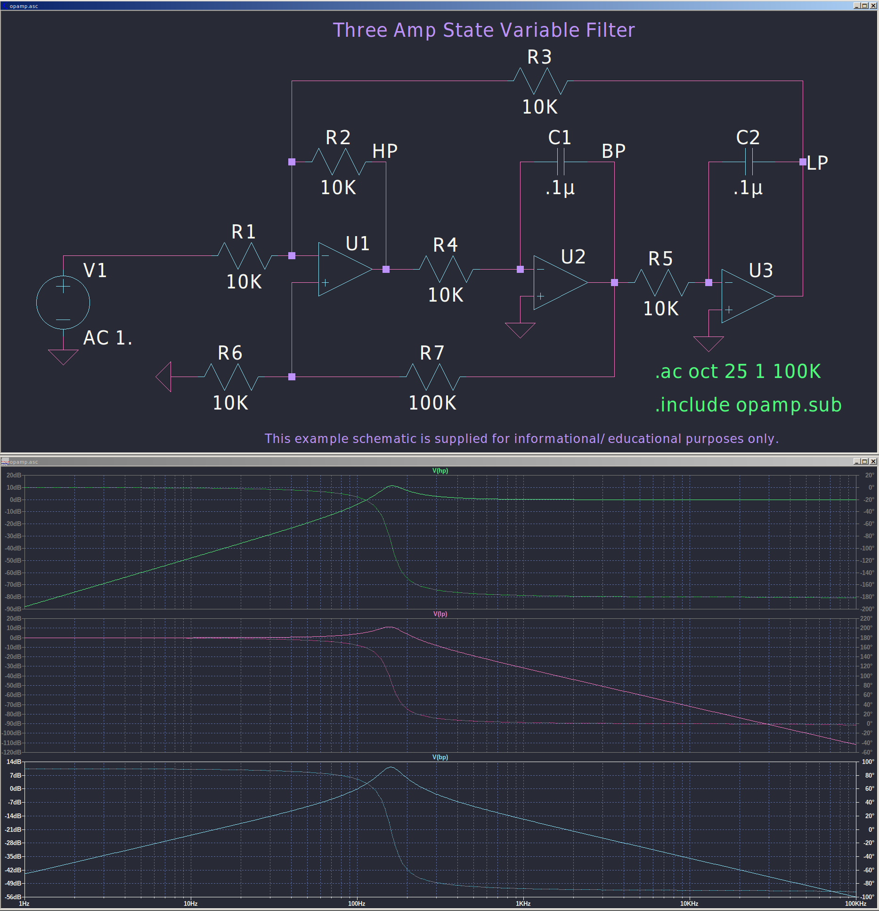

# Dracula for [LTSpice](https://www.analog.com/en/design-center/design-tools-and-calculators/ltspice-simulator.html)

> A dark theme for [LTSpice](https://www.analog.com/en/design-center/design-tools-and-calculators/ltspice-simulator.html).

## Install

All instructions can be found at [draculatheme.com/ltspice](https://draculatheme.com/ltspice).

## Team

This theme is maintained by the following person(s) and a bunch of [awesome contributors](https://github.com/dracula/ltspice/graphs/contributors).

 |
--- |
[Tim Clifford](https://github.com/tim-clifford) |

## License

[MIT License](./LICENSE)